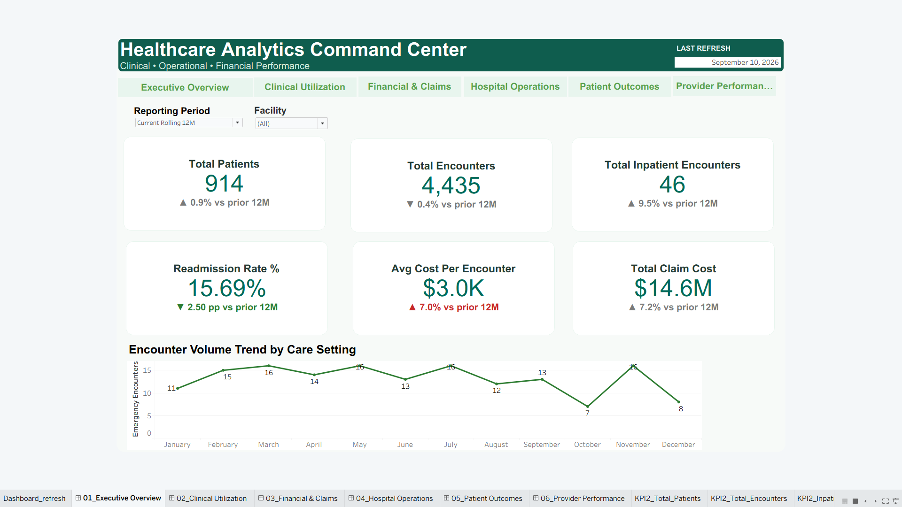
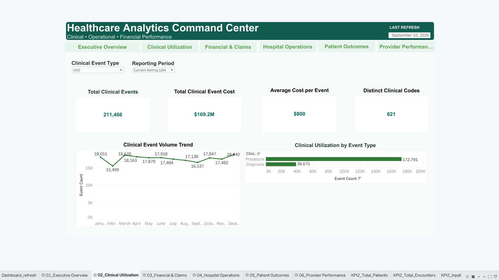
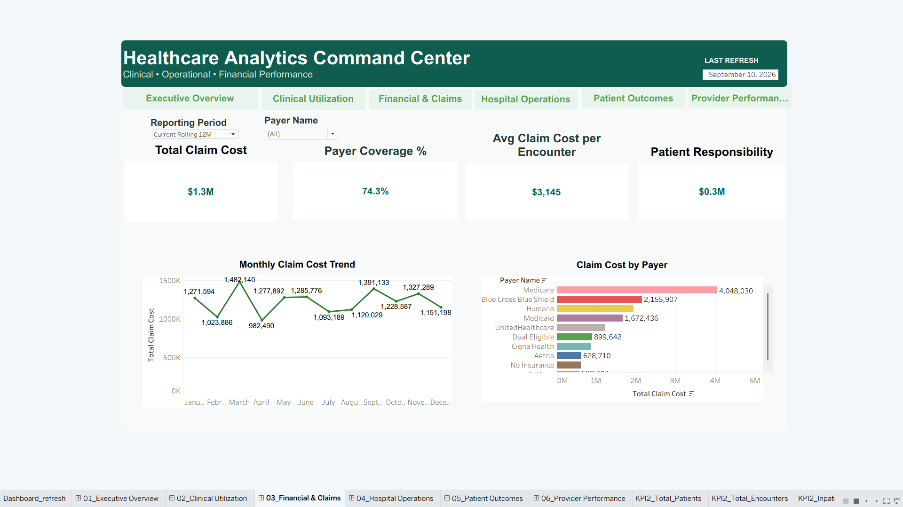
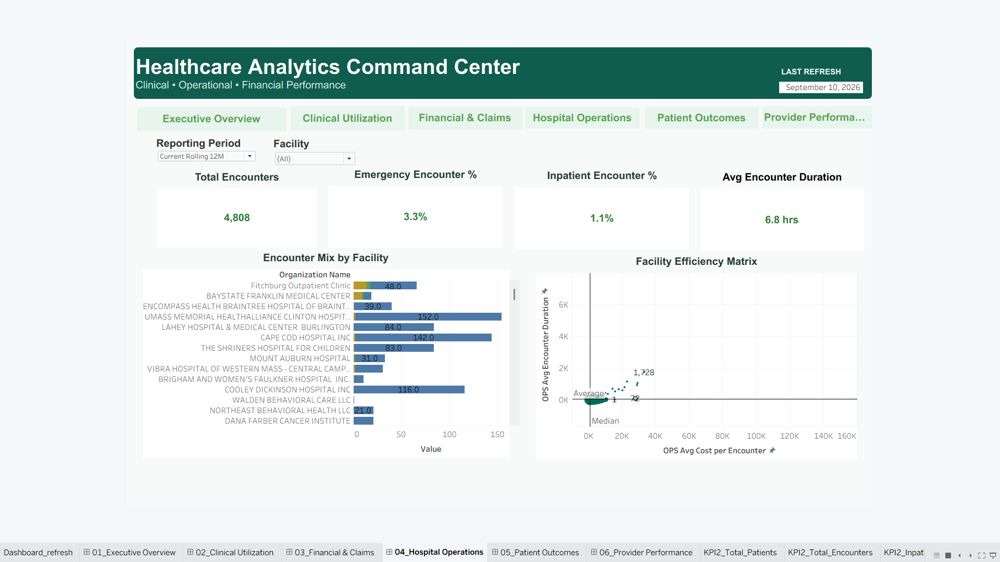
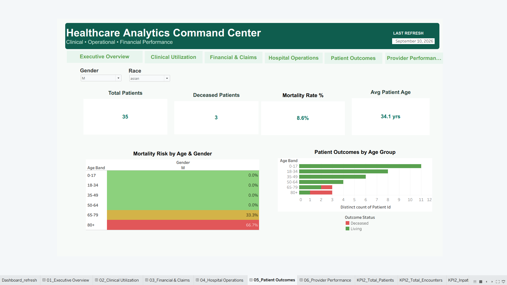
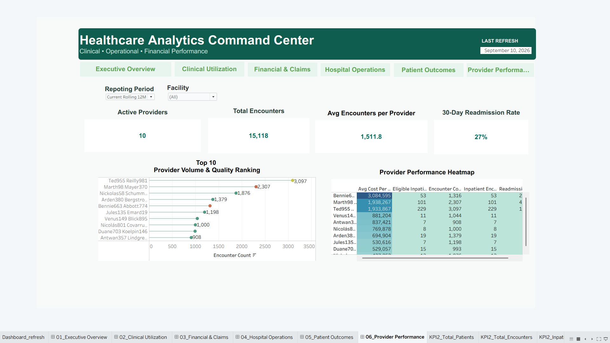

# Healthcare Analytics Platform

End-to-end healthcare analytics platform built with **Azure Data Factory, Azure Data Lake Storage Gen2, Azure Databricks, PySpark, Delta Lake, Databricks SQL, and Tableau** using synthetic Synthea healthcare data.

The project demonstrates a complete analytics workflow from ingestion and medallion-layer transformation through data-quality validation and executive reporting.

> **Data privacy note:** This portfolio project uses synthetic healthcare data only. No real patient data or PHI is included.

---

## Dashboard Preview

### Executive Overview



The Executive Overview provides a leadership-level snapshot of patient activity, encounter volume, inpatient utilization, readmissions, average encounter cost, total claim cost, and encounter trends.

---

## Dashboard Pages

### 1. Executive Overview


Focus areas:
- Total Patients
- Total Encounters
- Total Inpatient Encounters
- 30-Day Readmission Rate
- Average Cost per Encounter
- Total Claim Cost
- Encounter Volume Trend by Care Setting

### 2. Clinical Utilization



Focus areas:
- Total Clinical Events
- Total Clinical Event Cost
- Average Cost per Event
- Distinct Clinical Codes
- Clinical Event Volume Trend
- Clinical Utilization by Event Type

### 3. Financial & Claims



Focus areas:
- Total Claim Cost
- Payer Coverage %
- Average Claim Cost per Encounter
- Patient Responsibility
- Monthly Claim Cost Trend
- Claim Cost by Payer

### 4. Hospital Operations



Focus areas:
- Total Encounters
- Emergency Encounter %
- Inpatient Encounter %
- Average Encounter Duration
- Encounter Mix by Facility
- Facility Efficiency Matrix

### 5. Patient Outcomes



Focus areas:
- Total Patients
- Deceased Patients
- Mortality Rate
- Average Patient Age
- Mortality Risk by Age & Gender
- Patient Outcomes by Age Group

### 6. Provider Performance



Focus areas:
- Active Providers
- Total Encounters
- Average Encounters per Provider
- 30-Day Readmission Rate
- Provider Volume & Quality Ranking
- Provider Performance Heatmap

---

## Architecture

```text
Synthetic Synthea Healthcare Data
            |
            v
Azure Data Factory
pl_ingest_synthea_to_bronze
            |
            v
Azure Data Lake / Bronze Landing
            |
            v
Azure Databricks
            |
            +--> 00_bronze_inventory_and_load
            +--> 01_silver_core_transformations
            +--> 02_gold_dimensional_model
            +--> 03_gold_analytics_marts
            +--> 04_data_quality_validation
            |
            v
Delta Lake
Bronze -> Silver -> Gold
            |
            v
Databricks SQL / Gold Analytics Layer
            |
            v
Tableau
Healthcare Analytics Command Center
```

---

## Technology Stack

| Layer | Technology |
|---|---|
| Data Source | Synthetic Synthea healthcare data |
| Orchestration | Azure Data Factory |
| Data Lake | Azure Data Lake Storage Gen2 |
| Processing | Azure Databricks |
| Engineering | PySpark, Spark SQL |
| Storage Format | Delta Lake |
| Architecture | Medallion Architecture: Bronze, Silver, Gold |
| Analytics | Databricks SQL |
| Visualization | Tableau |
| Version Control | Git, GitHub |

---

## Databricks Data Model

The project uses the `healthcare_analytics` catalog with three primary schemas:

```text
healthcare_analytics
|
+-- bronze
+-- silver
+-- gold
```

### Bronze
Preserves the raw synthetic healthcare source data and ingestion metadata.

### Silver
Applies data cleaning, schema standardization, type conversion, deduplication, and reusable business logic.

### Gold
Provides analytics-ready dimensional models and marts used by Tableau for executive, clinical, financial, operational, patient-outcome, and provider-performance reporting.

---

## Databricks Notebook Workflow

```text
00_bronze_inventory_and_load
        |
        v
01_silver_core_transformations
        |
        v
02_gold_dimensional_model
        |
        v
03_gold_analytics_marts
        |
        v
04_data_quality_validation
```

The notebooks cover ingestion inventory, data standardization, dimensional modeling, analytics marts, and validation checks.

---

## Azure Data Factory

The ingestion layer is orchestrated through Azure Data Factory.

Main pipeline:

```text
pl_ingest_synthea_to_bronze
```

The pipeline moves synthetic Synthea source files into the Bronze landing layer for downstream Databricks processing.

Sanitized ADF artifacts are stored in:

```text
pipelines/
```

Environment-specific secrets and credentials are intentionally excluded from the repository.

---

## SQL Analytics Layer

The `sql/` directory contains analytical and validation queries supporting:

- Executive KPI reporting
- Clinical utilization
- Financial and claim analysis
- Hospital operations
- Patient outcomes
- Provider performance
- Readmission analysis
- Data-quality checks
- Dashboard reconciliation

---

## Data Quality

The project includes validation checks for common analytics engineering risks, including:

- Missing critical identifiers
- Duplicate keys
- Invalid encounter timestamps
- Negative financial values
- Referential-integrity issues
- Dashboard-level reconciliation

---

## Healthcare Data Governance

Although the project uses synthetic data, the architecture demonstrates healthcare-aware engineering principles:

- Data minimization
- Least-privilege access
- Separation of Bronze, Silver, and Gold layers
- Secret management outside source control
- Encryption expectations for production workloads
- Auditability and reproducibility
- Data-quality controls
- No real PHI committed to GitHub

This portfolio project demonstrates **HIPAA-aware design principles**; it does not claim that the repository itself constitutes a HIPAA-certified production environment.

---

## Repository Structure

```text
healthcare-analytics-platform/
|
+-- docs/
|   +-- screenshots/
|       +-- 01_executive_overview.png
|       +-- 02_clinical_utilization.png
|       +-- 03_financial.png
|       +-- 04_hospital_operations.png
|       +-- 05_patient_outcomes.png
|       +-- 06_performance.png
|
+-- notebooks/
|   +-- 00_bronze_inventory_and_load
|   +-- 01_silver_core_transformations
|   +-- 02_gold_dimensional_model
|   +-- 03_gold_analytics_marts
|   +-- 04_data_quality_validation
|
+-- pipelines/
|   +-- ADF pipeline and dataset artifacts
|
+-- sql/
|   +-- analytics and validation SQL
|
+-- tableau/
|   +-- Tableau project artifacts
|
+-- .gitignore
+-- README.md
```

---

## Business Questions Answered

This platform is designed to answer questions such as:

- How are patient and encounter volumes changing?
- What percentage of encounters are inpatient or emergency?
- Which facilities have the highest utilization or operating cost?
- How are claim costs distributed across payers?
- How much financial responsibility remains with patients?
- Which age groups show the highest mortality risk?
- Which providers carry the greatest encounter volume?
- Where are 30-day readmissions concentrated?
- Which operational areas warrant deeper review?


---

## Project Highlights

- Built an end-to-end Azure healthcare analytics workflow
- Implemented Bronze, Silver, and Gold medallion layers
- Developed Databricks transformations using PySpark and SQL
- Created dimensional and analytical Gold models
- Added data-quality and reconciliation controls
- Built six Tableau dashboard views spanning clinical, operational, financial, outcome, and provider analytics
- Applied healthcare-aware data-governance and source-control practices

---

## Author

**Likhith Yedida**

Data Analytics | Business Intelligence | Data Engineering

